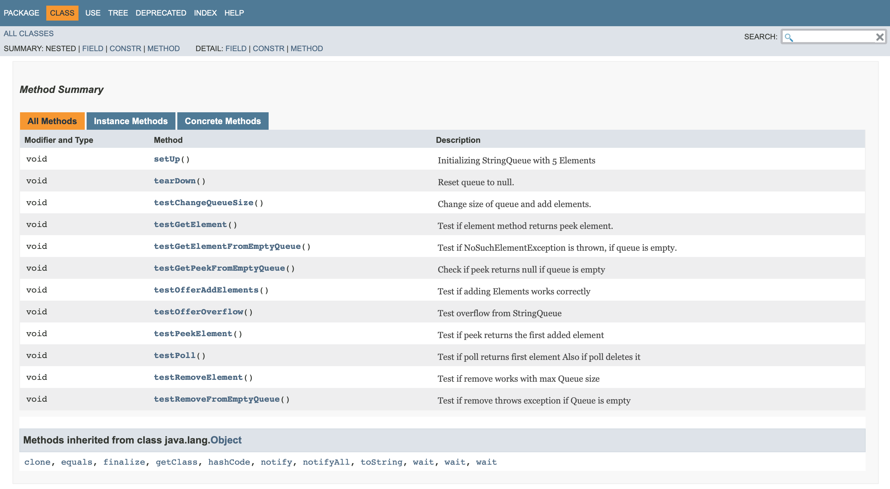

# Abgabe 04: Vertiefende Gesamtwiederholung #

### 19-Abgabe04-Wurm-Kostmann ###

Die Übung dient als Repetitorium aller bereits absolvierten Übungen. Die readme.md dient als Bereicht zur Abgabe 4.

**Team**

*Florian Kostmann*

*Leopold Wurm*

**Repository**

[https://github.com/flokosti/19-Abgabe04-Wurm-Kostmann.git](https://github.com/flokosti/19-Abgabe04-Wurm-Kostmann.git)

## Task List ##

- [x]  Project review (Queue)
  - [x] Find three errors
- [x] Comments with Javadoc API for class files and methods
  - [x] Integrate an image in the report
- [x] Write JUnit Test-Cases
  - [x] Comment Test-Cases with Javadoc API
  - [x] Integrate an image in the report
- [x] Adapt pom.xml
  - [x] Integrate log4j library as maven-dependency
- [x] Implement log4j
  - [x] Static logger
  - [x] Integrate image of log massages
- [x] Maven Site Documentation
  - [x] Integrate Javadoc and JUnit Test-Cases
  - [x] Integrate menu with reference to manually generated sites
- [x] Finally update readme.md for Lab Report
  - [x] Integrate Codeblock
  - [ ] Export pdf

## Vorgehen ##

### Vorbereitungen ###

Zuerst wurde die Taskliste im Markdown Format im readme.md hinzugefügt. Die Punkte wurden von der Aufgabenstellung
übernommen. Anschließend wurde das "Musterprojekt" in IntelliJ importiert, ein Repository erstellt und ein
initial commit von Florian durchgeführt. 

### Project review ###
**Fehlersuche**

Die Fehler wurden im Team gesucht und gefunden.

Gefundene und korrigierte Fehler:

- Übergabeparameter im Konstruktor
- poll(): Vergleichsoperator von == auf != geändert
- remove(): Entfernen der Überschreibung mit von Element mit einem leeren String

Der Code wurde bei der Implementierung vom static logger mit mehr Klammern versehen.

### JavaDoc ###

Die Kommentare wurden von beiden Teammitgliedern verfasst. Die Kommentare wurden zum Schluss noch einmal
überarbeitet, da beim build einige Fehler auftraten und die Beschreibungen im Queue Interface bei den @param fehlten. 

**Erkenntnis:**

"-->" als Kommentar erzeugt einen Fehler beim build Prozess.


### JUnit Test Cases ###

Für die JUnit Tests wir uns abgestimmt wer für welche Methoden Test Cases implementiert. 
Die jeden der Test Cases wurden JavaDoc Kommentare hinzugefügt. 

**Hier ein Beispiel eines Tests:**
```
  /**
     * Test overflow from StringQueue
     */
    @Test
    public void testOfferOverflow() {
        Assert.assertTrue(q.offer("Obj1"));
        Assert.assertTrue(q.offer("Obj2"));
        Assert.assertTrue(q.offer("Obj3"));
        Assert.assertTrue(q.offer("Obj4"));
        Assert.assertTrue(q.offer("Obj5"));
        Assert.assertFalse(q.offer("Obj6"));
    }
```



### pom.xml ###
**Entwickler Informationen**

Die pom.xml ist mit unseren spezifischen Informationen (Entwickler, Projektdaten usw.) erweitert worden.

**log4j Bibliothek**

Die log4j Bibliothek wurde in den Maven Dependencies hinzugefügt.

### log4j Integration ###

Florian hat bei allen Methoden eine Info oder Error Lognachricht hinzugefügt. Diese werden über die konsole ausgegeben.


